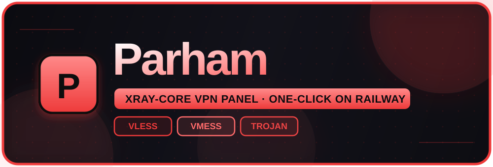
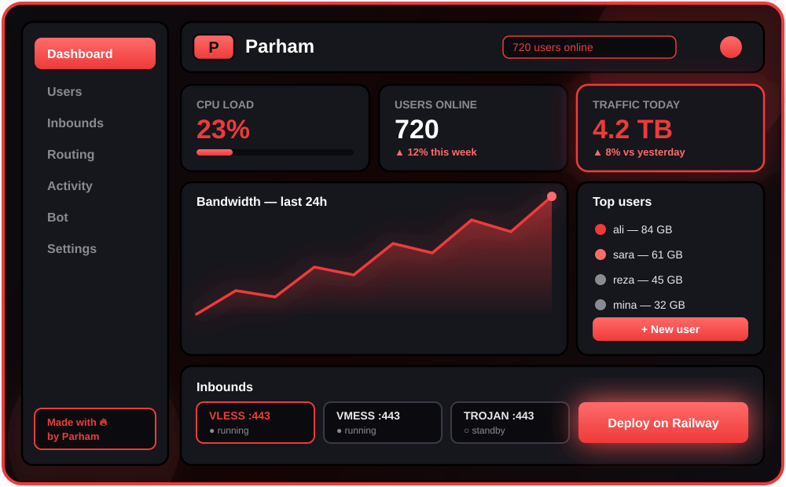

<div align="center">



<br/>
<br/>

<a href="https://railway.com/new">
  
</a>

<br/>
<br/>

<p>
  <a href="LICENSE"></a>
  &nbsp;
  <a href="https://github.com/XTLS/Xray-core"></a>
  &nbsp;
  <a href="https://www.typescriptlang.org"></a>
  &nbsp;
  <a href="https://react.dev"></a>
</p>
<p>
  
  &nbsp;
  
</p>

<br/>
<br/>

**A blood-red, neobrutalist VPN control panel — powered by&nbsp;<a href="https://github.com/XTLS/Xray-core">Xray-core</a>&nbsp;and shipped to&nbsp;<a href="https://railway.app">Railway</a>&nbsp;in one click.**

*Clean client links. Live stats. Gorgeous subscription pages. No config, no fuss.*

</div>

<br/>



> [!TIP]
> **Fork → Deploy on Railway → Expose port `8080` → Open the panel.** Four steps, zero config, live in minutes.
>
> <details>
> <summary>🇮🇷 راهنمای فارسی استقرار</summary>
>
> ۱. همین ریپو رو **Fork** کن به اکانت خودت.
> ۲. توی Railway پروژه جدید بساز و **Deploy from GitHub repo** رو بزن.
> ۳. خودش بیلد می‌گیره و بالا میاد — هیچ متغیری لازم نیست.
> ۴. توی **Settings → Networking** دکمه **Generate Domain** رو بزن و پورت رو بذار **`8080`**.
> ۵. (اختیاری) یه **Volume** روی مسیر **`/data`** وصل کن که یوزرها و تنظیمات با ری‌دیپلوی نپرن.
> ۶. دامنه رو باز کن، صفحه **Setup** میاد — اکانت **Owner** رو بساز و وارد شو. 🔥
>
> </details>

<br/>


<table>
<tr>
<td width="50%" valign="top">

**One job, done right**

No feature bloat. Parham masters **HTTP-based transports behind a TLS edge** — every link is clean, standard, and always `security=tls` on port `443`.

</td>
<td width="50%" valign="top">

**Impossible to ignore**

A loud **red-on-black** UI — thick borders, hard shadows, glowing buttons, floating bubbles, real UI sounds — razor-sharp on phone and desktop alike.

</td>
</tr>
<tr>
<td width="50%" valign="top">

**Deploy and forget**

Xray-core pulls itself on first boot, the session secret is generated for you, and the DB just works. **Zero environment variables required.**

</td>
<td width="50%" valign="top">

**Team-friendly**

The Owner adds Admins with scoped page access and personal data quotas — and every Admin only ever sees the users they created.

</td>
</tr>
</table>

<br/>


| Area | What you get |
|:--|:--|
| **Dashboard** | Live CPU, RAM, Swap and Storage metrics, plus one-click Backup & Restore of users, inbounds, admins and settings. |
| **Users** | Rich create form, summary cards, a fully responsive table, live **Connected IPs**, and per-user actions. |
| **Inbounds** | Five HTTP inbounds auto-seeded on first boot. Enable or disable only, each with a unique port. |
| **Activity Log** | A live timeline of every administrative event. |
| **Settings & Admins** | Owner and Admin roles, scoped permissions, and per-admin data quotas. |
| **Subscription** | A gorgeous per-user page with a live usage chart, QR codes and a base64 subscription for clients. |
| **Telegram Bot** | Optional bot: get your sub link + QR right inside Telegram. |
| **Security** | JWT sessions, built-in rate limiting, and sniffing fully disabled to prevent the QUIC crash. |

<br/>


**Signature red/black "Parham" look** across the whole panel:

- 🩸 Deep-red accent (`#ee3a3a`) — glowing gradient buttons, red scrollbar, red selection
- 🫧 Animated gradient backdrop + floating red bubbles (canvas, zero deps)
- 🔊 Real UI sounds (Kenney CC0: click, toggle, open/close, success/error/notify) with a mute button
- ✨ Ripple + spark burst on every real tap, modal pop-in, toast shake on errors, glowing sidebar + logo
- 🃏 Frosted-glass cards (`bg-bw/80` + `backdrop-blur-sm`) with a red hover glow
- 🅿️ Glowing red **P** logo everywhere + `Made with 🔥 by Parham` footer

| Swatch | Token | Use |
|:--|:--|:--|
|  `#ee3a3a` | `--main: 238 58 58` | Buttons, accents, glow, scrollbar |
|  `#ff6b6b` | — | Highlights, gradients, online dots |
|  `#0b0b0f` | `--bg` (dark) | App background |
|  `#16161d` | `--bw` (dark) | Cards, panels |

**Under the hood** — React 18 + Vite 6 + Tailwind 3 (neobrutalism), React Router, TanStack Query, Recharts, Radix UI · Express + Node 24 (node:sqlite), Xray-core fetched on first boot. TLS terminated at the Railway edge; WS/HTTPUpgrade via raw `net.Socket`, XHTTP through proxy. Only `ws`, `httpupgrade`, `xhttp` — raw TCP/gRPC/WireGuard intentionally left out (they don't survive the edge).

<br/>


**No code required. Just follow these steps:**

**1. Fork this repository** — click **Fork** at the top-right to copy it to your GitHub account.

**2. Create a Railway project** — head to&nbsp;<a href="https://railway.app">railway.app</a>, then **New Project → Deploy from GitHub repo**, and pick your fork.

**3. Deploy** — Railway reads the `Dockerfile` and builds automatically.

**4. Expose port `8080`** — open **Settings → Networking → Generate Domain**, and set the port to **`8080`**.

> [!IMPORTANT]
> Parham listens on port **`8080`** — this is the **only** port you expose. The ports `10085` and `20000–20004` are Xray's internal ports bound to `127.0.0.1`; they are private and must **not** be exposed.

**5. Add a volume (optional)** — attach a **Volume** at **`/data`** so users, admins and settings survive redeploys.

**6. Open your panel** — visit the generated `*.up.railway.app` domain, land on the **Setup** page, and create your **Owner** account.

<br/>


**All optional.**

| Variable | Default | Description |
|:--|:--|:--|
| `PORT` | `8080` | HTTP port. **Expose this one on Railway.** |
| `JWT_SECRET` | *auto* | Signs admin session cookies. Auto-generated and persisted if unset. |
| `XRAY_VERSION` | `v26.9.9` | Xray-core release fetched on first boot. |
| `PARHAM_DATA_DIR` | `/data` | Persistent data directory (mount a volume here). |
| `PUBLIC_DOMAIN` | *auto* | Override for a custom domain. Falls back to `RAILWAY_PUBLIC_DOMAIN`. |
| `XRAY_API_PORT` | `10085` | Internal Xray stats API port. |
| `XRAY_INBOUND_BASE_PORT` | `20000` | Base port for internal inbound listeners. |

<br/>


```
apps/
├─ web/           React + Vite + Tailwind (Parham red/black theme) frontend
│  └─ src/
│     ├─ components/parham-fx.*  Bubbles, ripples, sounds, red glow effects
│     ├─ components/ui/          Reusable neobrutalist primitives (glass cards, glow buttons)
│     ├─ pages/                  Dashboard · Users · Inbounds · Activity · Settings · Setup · Login · Subscription
│     └─ lib/                    API client, auth context, brand, helpers
└─ server/        Express + Node (node:sqlite) backend
   └─ src/
      ├─ xray.ts          Binary fetch, process manager, traffic stats, client IPs
      ├─ xray-config.ts   Config builder (sniffing fully disabled)
      ├─ tunnel.ts        WS/HTTPUpgrade via net.Socket, XHTTP via http-proxy
      ├─ links.ts         VLESS/VMess/Trojan link generation
      ├─ inbounds.ts      Default inbound seeding + enable/disable
      ├─ users.ts         User model, traffic reset, sub-token logic
      ├─ auth.ts          Owner/Admin roles, permissions, sessions
      ├─ ratelimit.ts     Rate limiting / brute-force protection
      └─ routes.ts        Authenticated REST API
```

<br/>


**Requires Node.js ≥ 22.5 (Node 24 recommended).**

```bash
npm install     # install all workspaces
npm run dev     # web on :5173, server on :8080 (proxied)

npm run build   # production build (web + server)
npm start       # serve API + built frontend on :8080
```

<br/>


**Parham is proprietary software. © 2025 Parham — all rights reserved.**

It is published for transparency and personal self-hosting only. You are welcome to fork and run your own instance, but the following are **strictly prohibited** without prior written permission:

- Selling, reselling, or offering Parham (or any derivative) as a paid product or service.
- White-labeling or re-branding it under another name.
- Removing or altering the **Parham** attribution, branding, logos, repository links, or the embedded authorship watermarks.
- Claiming authorship of the project.

The source code carries embedded authorship identifiers and watermarks used to prove origin.

<a href="LICENSE">Full license terms</a>

<br/>

<div align="center">

Telegram: **[@par1234mehr](https://t.me/par1234mehr)**

Made with 🔥 by **Parham**

</div>
